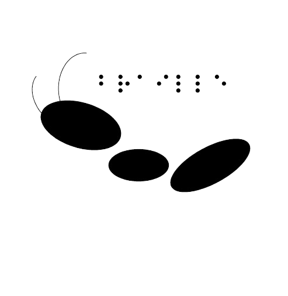

## 2026/08/11 - Version 0.1.5 Summary
- BrailleBase: Adjustments to the token size definition caused a bug that was not detected in the testing environment but was noticed after the version was released. The inconsistency has been fixed.

## 2026/08/02 - Version 0.1.4 Summary
- braillebase 0.1.4
- Table update, addition of new characters, and greek with the UEB standard.

## 2026/07/20 - Version 0.1.2 Summary
- braillebase 0.1.2
- Bug fix for the [translate_text_to_reverse braille()] method.
- Update to the HTML generator method [output_all_html()].

## 2026/07/13 - Version 0.1.1 Summary
- Addition of the base reverse Braille.
- Definition of the base architecture.

## 2026/06/23 — Version 0.0.9 Summary
- braillebase 0.0.15

## 2026/06/22 — Version 0.0.8 Summary
- braillebase 0.0.14

## 2026/06/14 — Version 0.0.7 Summary
- braillebase 0.0.13
- Modularization and Isolation of the CJK Block: Segregated the processing pipeline for CJK languages (Chinese, Japanese, and Korean).

## 2026/06/07 — Version 0.0.6 Summary
- braillebase 0.0.12
- Pre-registered Letters and Characters

## 2026/05/13 — Version 0.0.3 Summary
- braillebase 0.0.7
- Improved support for Latin letters compared to previous versions.

